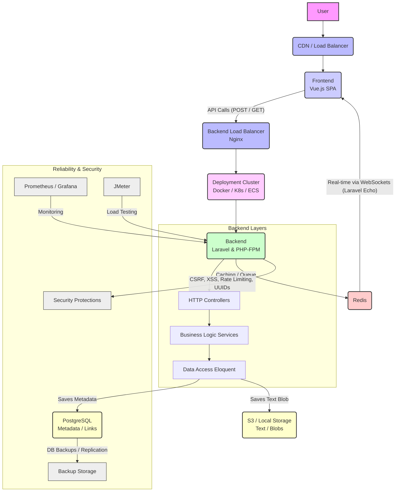

# pasteBin
A scalable web app for sharing text data via unique link

```mermaid

graph TD
    A[User] --> B(CDN / Load Balancer);

    B --> C(Frontend <br> Vue.js SPA);

    C -- API Calls (POST / GET) --> D(Backend Load Balancer <br> Nginx);

    D --> E(Deployment Cluster <br> Docker / K8s / ECS);

    E --> F(Backend <br> Laravel & PHP-FPM);

    subgraph Backend Layers
        F --> F1[HTTP Controllers];
        F1 --> F2[Business Logic Services];
        F2 --> F3[Data Access Eloquent];
    end

    F3 -- Saves Metadata --> G(PostgreSQL <br> Metadata / Links);
    F3 -- Saves Text Blob --> H(S3 / Local Storage <br> Text / Blobs);

    F -- Caching / Queue --> I(Redis);
    I -- Real-time via WebSockets (Laravel Echo) --> C;

    subgraph Reliability & Security
        G -- DB Backups / Replication --> J[Backup Storage];
        K[Prometheus / Grafana] -- Monitoring --> F;
        L[JMeter] -- Load Testing --> F;
        F -- CSRF, XSS, Rate Limiting, UUIDs --> M[Security Protections];
    end

    style A fill:#f9f,stroke:#333,stroke-width:2px
    style B fill:#bbf,stroke:#333,stroke-width:2px
    style C fill:#ccf,stroke:#333,stroke-width:2px
    style D fill:#bbf,stroke:#333,stroke-width:2px
    style E fill:#fcf,stroke:#333,stroke-width:2px
    style F fill:#cfc,stroke:#333,stroke-width:2px
    style G fill:#ffc,stroke:#333,stroke-width:2px
    style H fill:#ffc,stroke:#333,stroke-width:2px
    style I fill:#fcc,stroke:#333,stroke-width:2px
    style J fill:#eee,stroke:#333,stroke-width:1px
    style K fill:#eee,stroke:#333,stroke-width:1px
    style L fill:#eee,stroke:#333,stroke-width:1px
    style M fill:#eee,stroke:#333,stroke-width:1px

```